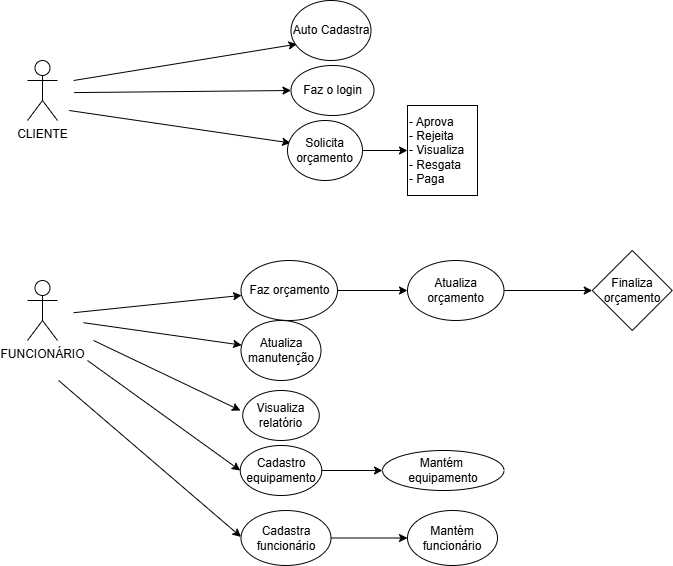

# ByteAssist - Controle de Manutenção de Equipamentos

## Alunos:

<div align="center">

| Nome                     | GRR         |
| ------------------------ | ----------- |
| Adriano Zandroski Soares | GRR20231029 |
| Iman de Lacerda          | GRR20193747 |
| Patrick Correia Camilo   | GRR20231008 |
| Thalita dos Santos       | GRR20231007 |
| Victor Pasini Bilbao     | GRR20231012 |

</div>

---

## Descrição do Projeto
Este sistema foi desenvolvido para gerenciar solicitações de serviços de manutenção de equipamentos, mantendo um histórico de alterações de estado. Possui dois perfis de usuário: **Cliente** e **Funcionário**, cada um com funcionalidades específicas. O projeto utiliza tecnologias modernas como **Angular** (Frontend) e **Spring Boot** (Backend), seguindo boas práticas de programação e padrões de projeto.

---

## Funcionalidades Principais
### Perfil Cliente:
- Autocadastro com validação de dados e integração com a API ViaCEP.
- Login com identificação automática do perfil.
- Registro de solicitações de manutenção, incluindo descrição do equipamento e defeito.
- Visualização de histórico de solicitações e aprovação/rejeição de orçamentos.
- Pagamento de serviços concluídos.

### Perfil Funcionário:
- Gestão de solicitações em diversos estados (Aberta, Orçada, etc.).
- Efetuação de orçamentos e manutenções.
- Redirecionamento de solicitações para outros funcionários.
- CRUD de categorias de equipamentos e de funcionários.
- Relatórios de receitas em PDF.

---

## Como Executar o Projeto

<details>
<summary>Backend</summary>

1. Navegue até a pasta do backend:
```bash
cd ./byteassist-backend
```

2. Execute o seguinte comando para iniciar o servidor:
```bash
./mvnw spring-boot:run
```

3. Acesse a aplicação no navegador em: [http://localhost:8080](http://localhost:8080)

</details>

<details>
<summary>Frontend</summary>

1. Navegue até a pasta do frontend:
```bash
cd ./byteassist-frontend
```

2. Instale as dependências do projeto:
```bash
npm install
```

3. Inicie o servidor de desenvolvimento:
```bash
ng serve
```

4. Acesse a aplicação no navegador em: [http://localhost:4200](http://localhost:4200)

</details>

---

## Diagramas: 

<details>
<summary>Diagrama de caso de uso:</summary>

Para facilitar o desenvolvimento, abaixo, o diagrama de caso de uso do cliente: 



</details>

---

## Contribuindo

Para informações sobre como contribuir com o projeto, consulte o arquivo [CONTRIBUTING.md](CONTRIBUTING.md).

Para detalhes sobre as APIs disponíveis, consulte a [Documentação da API](https://1428fdd8or.apidog.io)