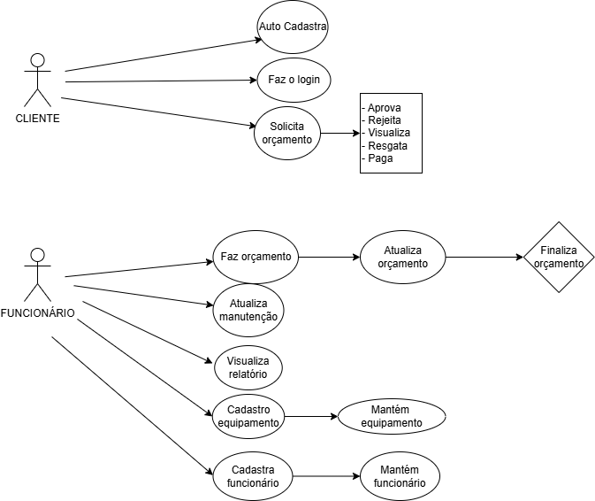

<div align="center">

[](https://github.com/VictorPBilbao/ProjetoWeb2/actions/workflows/run-tests.yml) [](https://byteassist.apidog.io) [](https://github.com/VictorPBilbao/ProjetoWeb2/actions/workflows/compile-jar-and-deploy.yml) [](https://github.com/VictorPBilbao/ProjetoWeb2) [](https://github.com/VictorPBilbao/ProjetoWeb2/issues)


# ByteAssist - Sistema de Gestão de Manutenção de Equipamentos

### Sistema web moderno para gerenciamento completo de solicitações de manutenção e assistência técnica

</div>

---

## 👥 Equipe de Desenvolvimento

<div align="center">

| Nome                     | GRR         | Contribuição Principal                    |
|--------------------------|-------------|-------------------------------------------|
| Adriano Zandroski Soares | GRR20231029 | DevOps & System Integration               |
| Patrick Correia Camilo   | GRR20231008 | Database Architecture & Documentation     |
| Thalita dos Santos       | GRR20231007 | UX/UI Design & Frontend Components        |
| Victor Pasini Bilbao     | GRR20231012 | Backend Services, API Design and Security |


</div>

---

## 📋 Visão Geral

O **ByteAssist** é um sistema web completo e moderno desenvolvido para gerenciar solicitações de serviços de manutenção de equipamentos eletrônicos. O sistema oferece uma solução integrada que abrange desde o cadastro de clientes até a geração de relatórios financeiros, mantendo um histórico detalhado de todas as operações e estados das solicitações.

### 🎯 Objetivo

Facilitar a gestão de assistências técnicas através de uma plataforma digital que permita:
- **Clientes**: Solicitar serviços, acompanhar status e gerenciar pagamentos
- **Funcionários**: Gerenciar tarefas, criar orçamentos e gerar relatórios
- **Administradores**: Controlar usuários, equipamentos e categorias

---

## 🚀 Tecnologias Utilizadas

### 🔧 Backend
- **Java 21** - Linguagem principal
- **Spring Boot 3.5.3** - Framework principal
- **Spring Security** - Autenticação e autorização
- **SurrealDB** - Banco de dados NoSQL moderno
- **JWT (Java-JWT 4.5.0)** - Autenticação baseada em tokens
- **Thymeleaf** - Engine de templates para relatórios
- **OpenHTMLToPDF** - Geração de PDFs
- **JavaMail** - Serviço de envio de emails
- **BCrypt** - Criptografia de senhas
- **Maven** - Gerenciamento de dependências

### 🎨 Frontend
- **Angular 20.0.3** - Framework SPA moderno
- **TypeScript** - Linguagem principal
- **Bootstrap 5.3.6** - Framework CSS
- **RxJS** - Programação reativa
- **Chart.js + ng2-charts** - Gráficos e visualizações
- **SweetAlert2** - Alertas e modais elegantes
- **ngx-mask** - Máscaras de input
- **ngx-markdown** - Renderização de Markdown
- **Font Awesome** - Ícones

### 🛠️ Ferramentas e DevOps
- **Docker** - Containerização
- **Fly.io** - Deploy e hospedagem
- **GitHub Actions** - CI/CD
- **Lombok** - Redução de boilerplate Java
- **Dotenv** - Gerenciamento de variáveis de ambiente

---

## 🏗️ Arquitetura do Sistema

### 📊 Diagrama Arquitetural

```
┌─────────────────┐    ┌─────────────────┐    ┌─────────────────┐
│   Frontend      │    │    Backend      │    │   SurrealDB     │
│   (Angular)     │◄──►│  (Spring Boot)  │◄──►│   (Database)    │
│                 │    │                 │    │                 │
│ • Components    │    │ • Controllers   │    │ • Collections   │
│ • Services      │    │ • Services      │    │ • Relationships │
│ • Guards        │    │ • Repositories  │    │ • Functions     │
│ • Interceptors  │    │ • Security      │    │ • Indexes       │
└─────────────────┘    └─────────────────┘    └─────────────────┘
        │                       │                      │
        │              ┌─────────────────┐             │
        │              │   External      │             │
        └──────────────│   Services      │─────────────┘
                       │                 │
                       │ • Email (SMTP)  │
                       │ • ViaCEP API    │
                       │ • PDF Generator │
                       └─────────────────┘
```

### 🔐 Sistema de Autenticação

O sistema utiliza **JWT (JSON Web Tokens)** para autenticação stateless:

1. **Login**: Usuário envia credenciais
2. **Validação**: Backend verifica no SurrealDB
3. **Token**: JWT gerado com claims (user, role, expiration)
4. **Autorização**: Token enviado em todas as requisições
5. **Middleware**: SecurityFilter valida token automaticamente

### 👤 Sistema de Autorização (RBAC)

```
Admin (ROLE_ADMIN)
├── Todas as permissões do Manager
├── Gerenciar usuários
├── Configurações do sistema
└── Acesso total

Manager (ROLE_MANAGER)  
├── Todas as permissões do Employee
├── Deletar equipamentos
├── Relatórios avançados
└── Gerenciar orçamentos

Employee (ROLE_EMPLOYEE)
├── Todas as permissões do Client
├── Visualizar todas as tarefas
├── Criar e editar orçamentos
├── Gerar relatórios
└── Gerenciar equipamentos

Client (ROLE_CLIENT)
├── Criar solicitações
├── Visualizar próprias tarefas
├── Aprovar/rejeitar orçamentos
├── Realizar pagamentos
└── Gerenciar conta
```

---

## 📱 Funcionalidades Detalhadas

### 👨‍💼 Portal do Cliente

#### 🔐 **Autenticação e Cadastro**
- **Registro**: Cadastro completo com validação de dados
- **Integração ViaCEP**: Preenchimento automático de endereço por CEP
- **Validação**: Email e username únicos verificados em tempo real
- **Email de Boas-vindas**: Template HTML personalizado enviado automaticamente
- **Login**: Autenticação segura com JWT

#### 📋 **Gestão de Solicitações**
- **Criar Solicitação**: Interface intuitiva para descrever problemas
- **Seleção de Equipamento**: Escolha por categoria (Smartphone, Laptop, Desktop, etc.)
- **Acompanhamento**: Visualização de status em tempo real
- **Histórico**: Timeline completa de todas as solicitações

#### 💰 **Sistema de Orçamentos**
- **Visualização**: Detalhes completos dos orçamentos recebidos
- **Aprovação/Rejeição**: Interface simples com comentários opcionais
- **Status**: Estados claros (Pendente, Aceita, Rejeitada)
- **Notificações**: Alertas visuais para novos orçamentos

#### 💳 **Sistema de Pagamentos**
- **Checkout**: Interface moderna de pagamento
- **Métodos**: Cartão de crédito, débito, PIX
- **Confirmação**: Comprovantes digitais
- **Histórico**: Registro de todas as transações

#### 👤 **Gerenciamento de Conta**
- **Perfil**: Edição completa de dados pessoais
- **Segurança**: Alteração de senha
- **Endereço**: Atualização com validação de CEP
- **Preferências**: Configurações de notificação

### 🔧 Portal do Funcionário/Administrador

#### 📊 **Dashboard Avançado**
- **Métricas**: KPIs em tempo real
- **Gráficos**: Visualizações com Chart.js
- **Tarefas Pendentes**: Lista priorizada
- **Performance**: Indicadores de produtividade

#### 🛠️ **Gestão de Tarefas**
- **Listagem**: Filtros avançados (status, data, cliente)
- **Atribuição**: Auto-atribuição de tarefas
- **Status**: Fluxo completo (Aberta → Orçada → Em Andamento → Concluída)
- **Redirecionamento**: Transferência entre funcionários
- **Comentários**: Sistema de notas internas

#### 💼 **Sistema de Orçamentos**
- **Criação**: Interface intuitiva com calculadora
- **Templates**: Orçamentos pré-formatados
- **Aprovação**: Fluxo de aprovação automatizado
- **Histórico**: Versionamento de orçamentos

#### 📈 **Relatórios e Analytics**
- **Relatório de Receitas**: Por período e categoria
- **Geração PDF**: Templates profissionais com Thymeleaf
- **Exportação**: Download automático de relatórios
- **Filtros**: Por data, funcionário, categoria
- **Gráficos**: Vendas diárias e por categoria

#### 👥 **Gestão de Usuários** (Admin)
- **CRUD Completo**: Criar, visualizar, editar, deletar usuários
- **Controle de Acesso**: Atribuição de roles
- **Status**: Ativar/desativar contas
- **Auditoria**: Log de ações dos usuários

#### 🔧 **Gestão de Equipamentos**
- **Categorias**: Criação e gerenciamento de tipos
- **Equipamentos**: CRUD completo
- **Relacionamentos**: Vinculação com tarefas
- **Filtros**: Busca por tipo e status

---

## 🗄️ Estrutura do Banco de Dados

### 📋 Collections Principais

#### 👤 **User**
```javascript
{
  id: "user:username",
  email: "user@email.com",
  password: "encrypted_password",
  role: "Client|Employee|Manager|Admin",
  isActive: true,
  person: "person:username",
  time: {
    createdAt: datetime,
    lastLoginAt: datetime,
    updatedAt: datetime
  }
}
```

#### 👨‍💼 **Person**
```javascript
{
  id: "person:username",
  cpf: "12345678901",
  dob: date,
  gender: "M|F|O",
  phone: "11999999999",
  name: {
    first: "João",
    last: "Silva"
  },
  address: {
    street: "Rua das Flores",
    number: "123",
    complement: "Apto 45",
    neighborhood: "Centro",
    city: "Curitiba",
    state: "PR",
    zip: "80000000",
    country: "BR"
  }
}
```

#### 📋 **Task**
```javascript
{
  id: "task:TASK-XXXXX",
  title: "Reparo de tela",
  summary: "Tela quebrada após queda",
  type: "Reparo",
  status: "Aberta|Orçada|Em Andamento|Concluída|Rejeitada",
  creator: "user:client123",
  assignee: "user:employee456",
  equipment: "equipment:EQ-XXXXX",
  budget: "budget:BDG-XXXXX",
  time: {
    createdAt: datetime,
    updatedAt: datetime
  }
}
```

#### 💰 **Budget**
```javascript
{
  id: "budget:BDG-XXXXX",
  amount: 15000, // centavos
  description: "Troca de tela + película",
  creator: "user:employee456",
  accepted: "PENDENTE|ACEITA|REJEITADA"
}
```

#### 🔧 **Equipment**
```javascript
{
  id: "equipment:EQ-XXXXX",
  brand: "Samsung",
  model: "Galaxy S21",
  type: "Smartphone",
  description: "Descrição detalhada"
}
```

### 🔗 Relacionamentos

- **User** ↔ **Person** (1:1)
- **Task** → **User** (creator, assignee)
- **Task** → **Equipment** (1:1)
- **Task** → **Budget** (1:1)
- **Budget** → **User** (creator)

---

## 🛡️ Segurança

### 🔐 **Autenticação**
- **JWT Tokens**: Stateless authentication
- **BCrypt**: Hash de senhas com salt
- **Expiração**: Tokens com TTL de 24 horas
- **Refresh**: Renovação automática no frontend

### 🔒 **Autorização**
- **RBAC**: Role-Based Access Control
- **Method Security**: `@PreAuthorize` em endpoints
- **Resource Protection**: Acesso baseado em ownership
- **CORS**: Configurado para domínios específicos

### 🛡️ **Validação**
- **Bean Validation**: Anotações Jakarta Validation
- **Custom Validators**: Validações específicas de negócio
- **Input Sanitization**: Limpeza de dados de entrada
- **SQL Injection**: Prevenção com queries parametrizadas

---

## 📧 Sistema de Email

### ✉️ **Funcionalidades**
- **Template HTML**: Email de boas-vindas personalizado
- **SMTP Gmail**: Configuração segura
- **Variáveis Dinâmicas**: Nome, username, credenciais
- **Design Responsivo**: Compatible com todos os clientes

### 📝 **Templates Disponíveis**
- **Welcome Email**: Enviado no cadastro
- **Password Reset**: Recuperação de senha (futuro)
- **Notifications**: Atualizações de status (futuro)

---

## 📊 Sistema de Relatórios

### 📈 **Tipos de Relatório**
- **Receitas Diárias**: Vendas agrupadas por dia
- **Receitas por Categoria**: Análise por tipo de equipamento
- **Performance**: Métricas de funcionários
- **Histórico**: Dados históricos completos

### 🎨 **Tecnologias**
- **Thymeleaf**: Templates HTML para PDFs
- **OpenHTMLToPDF**: Conversão HTML → PDF
- **Chart.js**: Gráficos interativos no frontend
- **Bootstrap**: Layout responsivo dos relatórios

### 📅 **Filtros Disponíveis**
- **Período**: Data início e fim
- **Categoria**: Tipo de equipamento
- **Funcionário**: Filtro por assignee
- **Status**: Estado das tarefas

---

## 🚀 Como Executar

### 📋 **Pré-requisitos**
- **Java 21+**
- **Node.js 18+**
- **Angular CLI 20+**
- **Maven 3.6+**
- **SurrealDB** (Docker recomendado)

### 🐳 **Usando Docker (Recomendado)**

1. **Clone o repositório**
```bash
git clone https://github.com/VictorPBilbao/ProjetoWeb2.git
cd ProjetoWeb2
```

2. **Configure o banco de dados**
```bash
# Inicie SurrealDB
docker run -d -p 8000:8000 surrealdb/surrealdb:latest start
```

3. **Configure variáveis de ambiente**
```bash
# Crie arquivo .env na raiz do backend
echo "JWT_SECRET=seu_jwt_secret_super_seguro" > byteassist-backend/.env
echo "EMAIL_PASSWORD=sua_senha_app_gmail" >> byteassist-backend/.env
```

### 🔧 **Backend Setup**

<details>
<summary>💻 Execução Local</summary>

1. **Navegue para o backend**
```bash
cd byteassist-backend
```

2. **Execute com Maven**
```bash
./mvnw spring-boot:run
```

3. **Verifique a execução**
```bash
curl http://localhost:8080/api/auth/health
# Deve retornar: OK
```

**Endpoints principais:**
- API Base: `http://localhost:8080`
- Health Check: `http://localhost:8080/api/auth/health`
- API Docs: `https://byteassist.apidog.io`

</details>

### 🎨 **Frontend Setup**

<details>
<summary>💻 Execução Local</summary>

1. **Navegue para o frontend**
```bash
cd byteassist-frontend
```

2. **Instale dependências**
```bash
npm install
```

3. **Inicie o servidor de desenvolvimento**
```bash
ng serve
```

4. **Acesse a aplicação**
```
http://localhost:4200
```

**Scripts disponíveis:**
```bash
npm run start     # Servidor de desenvolvimento
npm run build     # Build de produção
npm run test      # Testes unitários
npm run lint      # Linting do código
```

</details>

### 🌐 **Deploy em Produção**

O sistema está configurado para deploy automático:

- **Backend**: Fly.io (https://byteassist-backend.fly.dev)
- **Frontend**: GitHub Pages ou Vercel
- **Database**: SurrealDB Cloud
- **CI/CD**: GitHub Actions

---

## 📚 Documentação da API

### 🔗 **Links Úteis**
- **Documentação Completa**: [API Docs](https://byteassist.apidog.io)
- **OpenAPI Spec**: [Swagger JSON](https://byteassist-backend.fly.dev/v3/api-docs)

### 🔑 **Endpoints Principais**

#### 🔐 **Autenticação**
```http
POST /api/auth/login
POST /api/auth/register/{username}
GET  /api/auth/validate/email/{email}
GET  /api/auth/validate/username/{username}
```

#### 👤 **Usuários**
```http
GET    /api/user/me
GET    /api/user/{username}
GET    /api/user
POST   /api/user/{username}
PUT    /api/user/{username}
DELETE /api/user/{username}
```

#### 📋 **Tarefas**
```http
GET    /api/task
GET    /api/task/{id}
GET    /api/task/byUsername/{username}
POST   /api/task
PATCH  /api/task/{id}
DELETE /api/task/{id}
```

#### 💰 **Orçamentos**
```http
GET    /api/budget
GET    /api/budget/{id}
POST   /api/budget/{taskId}
PATCH  /api/budget/{id}
DELETE /api/budget/{id}
```

#### 🔧 **Equipamentos**
```http
GET    /api/equipment
GET    /api/equipment/{id}
GET    /api/equipment/byType?type={type}
POST   /api/equipment
PATCH  /api/equipment/{id}
DELETE /api/equipment/{id}
```

#### 📊 **Relatórios**
```http
GET /api/report/daily-report?start={date}&end={date}
GET /api/report/pdf
```

---

## 🔧 Configuração Avançada

### ⚙️ **Variáveis de Ambiente**

#### Backend (`application.properties`)
```properties
# Database
SURREALDB_URL=ws://localhost:8000/rpc
SURREALDB_USER=root
SURREALDB_PASS=root
SURREALDB_NAMESPACE=byteassist
SURREALDB_DATABASE=production

# Security
JWT_SECRET=your-super-secret-jwt-key-here

# Email
EMAIL_PASSWORD=your-gmail-app-password
MAIL_HOST=smtp.gmail.com
MAIL_USERNAME=byteassist.bot@gmail.com

# CORS
CORS_ORIGINS=http://localhost:4200,https://your-frontend-domain.com
```

#### Frontend (`environment.ts`)
```typescript
export const environment = {
  production: false,
  apiUrl: 'http://localhost:8080',
  features: {
    emailNotifications: true,
    advancedReports: true,
    paymentGateway: true
  }
};
```

### 🗄️ **Configuração do Banco**

```sql
-- Definir namespace e database
USE NS byteassist DB production;

-- Criar usuário da aplicação
DEFINE USER app ON DATABASE PASSWORD 'secure_password' ROLES EDITOR;

-- Definir funções personalizadas
DEFINE FUNCTION fn::relatorio_por_dia($start: datetime, $end: datetime) {
    RETURN SELECT 
        DATE(time.createdAt) AS createdAt,
        SUM(budget.amount) AS valor
    FROM Task 
    WHERE budget IS NOT NONE 
    AND time.createdAt >= $start 
    AND time.createdAt <= $end
    GROUP BY DATE(time.createdAt);
};
```

---

## 🎨 Customização e Extensibilidade

### 🔧 **Adicionando Novos Recursos**

#### Backend
1. **Controller**: Definir endpoints REST
2. **Service**: Lógica de negócio
3. **Repository**: Acesso a dados
4. **Model**: Entidades de domínio
5. **Validation**: Regras de validação

#### Frontend
1. **Component**: Interface do usuário
2. **Service**: Comunicação com API
3. **Model**: Tipos TypeScript
4. **Guard**: Proteção de rotas
5. **Pipe**: Transformação de dados

### 🎨 **Temas e Estilos**

O frontend utiliza **CSS Custom Properties** para facilitar customização:

```css
:root {
  --primary-color: #007bff;
  --secondary-color: #6c757d;
  --success-color: #28a745;
  --danger-color: #dc3545;
  --warning-color: #ffc107;
  --info-color: #17a2b8;
  
  --font-family-primary: 'Segoe UI', sans-serif;
  --border-radius: 0.375rem;
  --box-shadow: 0 0.125rem 0.25rem rgba(0, 0, 0, 0.075);
}
```

---

## 🤝 Contribuindo

### 📝 **Como Contribuir**

1. **Fork** o repositório
2. **Clone** seu fork localmente
3. **Crie** uma branch para sua feature (`git checkout -b feature/nova-funcionalidade`)
4. **Commit** suas mudanças (`git commit -am 'Adiciona nova funcionalidade'`)
5. **Push** para a branch (`git push origin feature/nova-funcionalidade`)
6. **Abra** um Pull Request

### 📋 **Diretrizes**

- **Código**: Siga os padrões de código existentes
- **Testes**: Adicione testes para novas funcionalidades
- **Documentação**: Atualize a documentação quando necessário
- **Commits**: Use mensagens claras e descritivas
- **Issues**: Relate bugs e solicite features via GitHub Issues

### 🔍 **Code Review**

Todos os PRs passam por revisão que verifica:
- **Funcionalidade**: O código funciona como esperado?
- **Qualidade**: Segue boas práticas e padrões?
- **Testes**: Tem cobertura adequada de testes?
- **Documentação**: Está adequadamente documentado?
- **Performance**: Não introduz problemas de performance?

---

## 📄 Licença

Este projeto está licenciado sob a **MIT License**. Veja o arquivo [LICENSE](LICENSE) para detalhes.

---

## 📞 Suporte e Contato

### 🆘 **Reportar Problemas**
- **GitHub Issues**: [Criar Issue](https://github.com/VictorPBilbao/ProjetoWeb2/issues/new)
- **Email**: byteassist.bot@gmail.com

### 📚 **Recursos Adicionais**
- **Documentação da API**: [API Docs](https://byteassist.apidog.io)
- **Wiki do Projeto**: [GitHub Wiki](https://github.com/VictorPBilbao/ProjetoWeb2/wiki)
- **Roadmap**: [GitHub Projects](https://github.com/VictorPBilbao/ProjetoWeb2/projects)

### 🌟 **Links Úteis**
- **Demo Live**: [ByteAssist Demo](https://byteassist-frontend.vercel.app)
- **Status Page**: [System Status](https://status.byteassist.com)
- **Changelog**: [Releases](https://github.com/VictorPBilbao/ProjetoWeb2/releases)

---

## 📊 Diagrama de Caso de Uso

<details>
<summary>Diagrama de caso de uso do cliente:</summary>

Para facilitar o desenvolvimento, abaixo, o diagrama de caso de uso do cliente: 



</details>

---

<div align="center">

### 🏆 **Projeto desenvolvido como trabalho final da disciplina de Desenvolvimento Web 2**
### 🎓 **Universidade Federal do Paraná - UFPR**
### 📅 **2024**

---

**Feito com ❤️ pela equipe ByteAssist**

[](https://www.ufpr.br/)

</div>